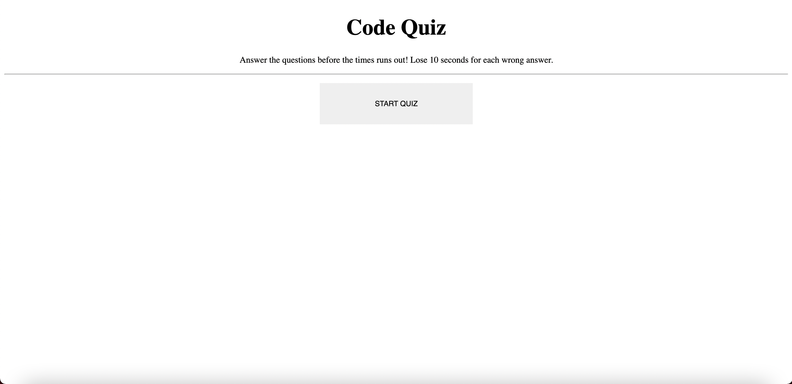
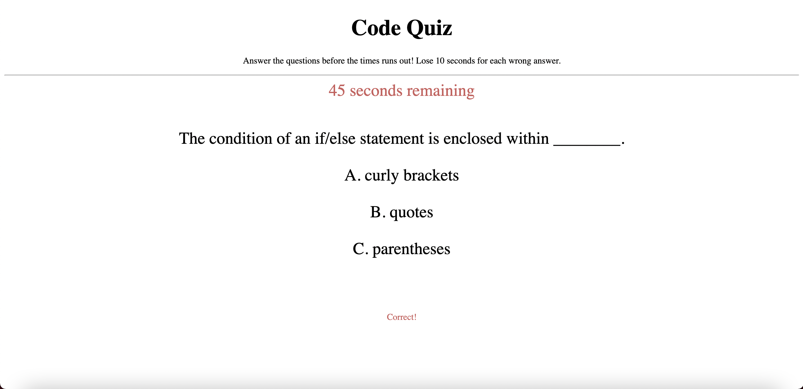
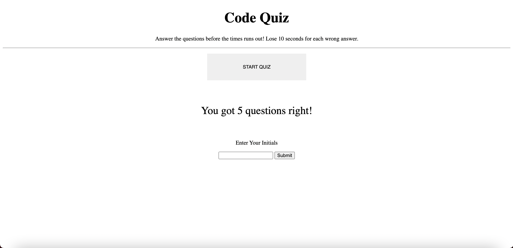
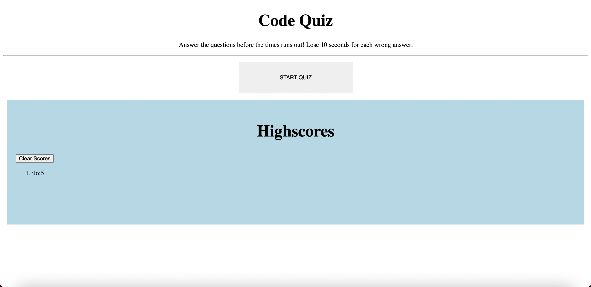

# Code-Quiz

## Description

This application is a timed, code-themed quiz of 12 questions that the user has 60 seconds to answer once they click the start button. For each correct answer selected, one point is added to the user's score. For each incorrect answer selected, 10 seconds are subtracted from the time remaining. 

The quiz ends when all questions have been answered or when the timer runs out. The user then has an option to enter initials to submit their score to the highscore list. The highscore list will then display the top 10 scores on the screen, in order from highest to lowest. The scores are stored in local storage. The user has the option to clear the stored scores from the list if they choose.  

## Images

## Application

## Technologies

This application was created using 
HTML
CSS
JavaScript